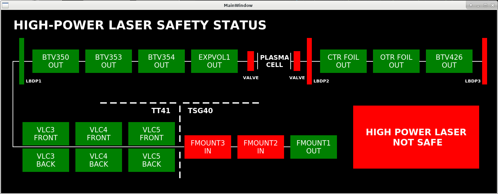

# AWAKE Laser Safe Vistars

A vistars-style panel to monitor intercepting devices in the path of the high power laser of AWAKE. 

## Description

The panel shows the position of the intercepting devices. The global status is calculated form the laser source to the first laser dump inserted.  

## Installation

This has not been packaged yet, so just clone the repository and execute `./launch_laser_fixdisplay.sh`. This will activate the acc-py distribution and launch the panel. 
